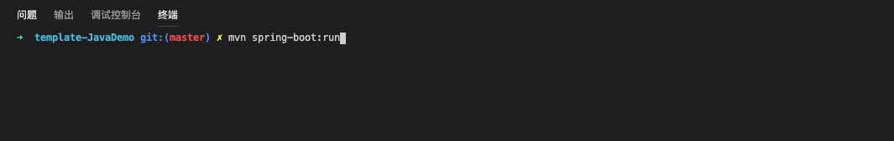
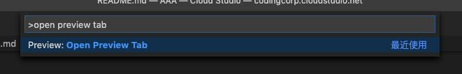
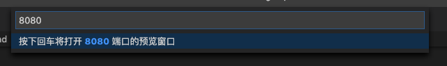

## 欢迎来到 Cloud Studio

在这里，您可以方便地使用您的专用主机进行开发。

我们为您准备了一个 Java 小示例，通过一个 Spring Boot 的 demo 代码，来展示 Java 环境的使用。

1. 在终端直接运行 `mvn spring-boot:run` 启动服务。(第一次运行时需要下载依赖，可能会花较长时间，请耐心等待)

2. 完全启动之后，打开命令面板（`Command + Shift + P` 或 `Ctrl + Shift + P`）并输入 `open preview tab`, 回车

3. 输入端口号 `8080`，若端口被占用，可在 `application.properties` 文件里修改为其他端口号即可。回车后将自动打开预览窗口

